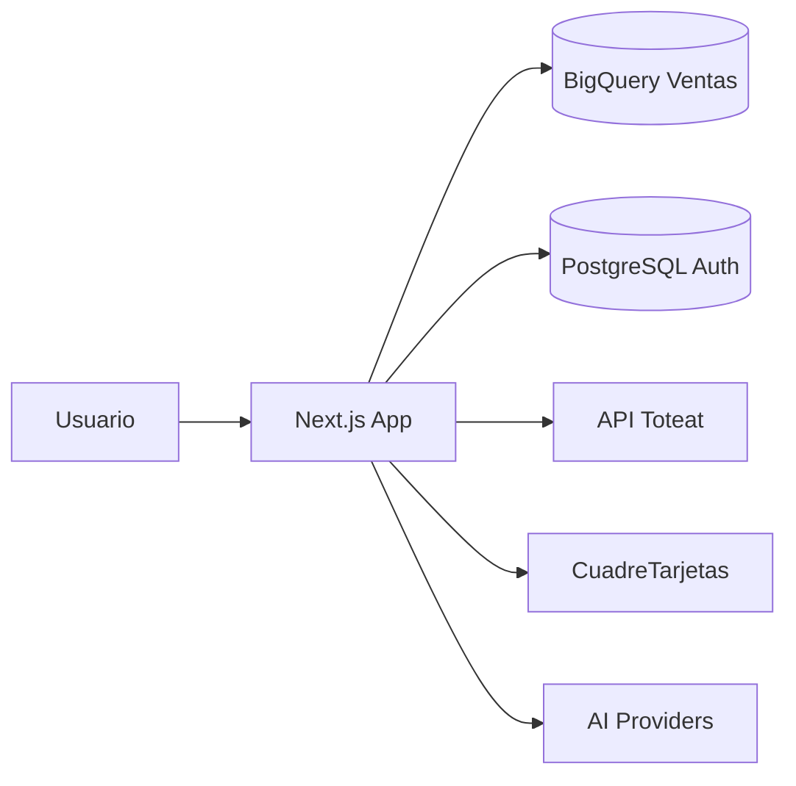

<p align="center">
  
</p>

<h1 align="center">Consultas Refugio v2</h1>

<p align="center">
  <strong>Dashboard inteligente y asistente de datos</strong> para Refugio Gastronómico<br/>
  Ventas · Toteat · Conciliación · BigQuery · IA
</p>

<p align="center">
  <a href="https://consultas.gcbprojects.site"></a>
</p>

<p align="center">
  
  
  
  
  
  
  
</p>

---

## Tabla de contenidos

- [Visión](#-visión)
- [Módulos](#-módulos)
- [Stack](#-stack)
- [Inicio rápido](#-inicio-rápido)
- [Variables de entorno](#-variables-de-entorno)
- [Scripts](#-scripts)
- [Arquitectura](#-arquitectura)
- [Despliegue](#-despliegue)
- [Documentación](#-documentación)
- [Licencia](#-licencia)

---

## Visión

**Consultas Refugio v2** centraliza el análisis operativo del complejo gastronómico:

| Área | Qué resuelve |
| --- | --- |
| Dashboard de ventas | KPIs, tendencia día/semana/mes, canales y medios de pago (BigQuery) |
| Toteat | Ventas en vivo desde API POS, cruce interno Refugio / Sisa / Limanesas |
| Conciliación | Cuadre de tarjetas (Toteat vs procesadores) |
| Asistente IA | Consultas en lenguaje natural sobre ventas, flujo y estacionamiento |
| Reportería | Exportes, tareas programadas y webhooks |

---

## Módulos

| Ruta | Descripción |
| --- | --- |
| `/` | Dashboard principal de ventas (BigQuery) |
| `/toteat` | Consultas Toteat + tendencia + cruce interno |
| `/auditoria` | Cobertura y calidad de conciliación |
| `/instancias` | Periodos / instancias de cuadre |
| `/proyecciones` | Presupuesto y proyecciones |
| `/reporteria` | Reportes por negocio / canal / medios |
| `/settings` | IA, SMTP, dashboard, webhooks |
| `/login` | Autenticación (JWT + PostgreSQL) |

---

## Stack

```text
┌─────────────┐   ┌──────────────┐   ┌─────────────┐
│  Next.js 16 │──▶│  BigQuery    │   │  API Toteat │
│  App Router │   │  Ventas DW   │   │  /sales …   │
└──────┬──────┘   └──────────────┘   └──────▲──────┘
       │                                    │
       ├──────────▶ PostgreSQL (auth)       │
       ├──────────▶ CuadreTarjetas API ─────┘
       └──────────▶ AI SDK (Gemini / Claude / GPT / DeepSeek)
```

- **UI:** Tailwind CSS 4, Lucide, Recharts, Plotly.js  
- **Auth:** cookie httpOnly + JWT (`jose`)  
- **Runtime:** Node 20, Docker multi-stage (`standalone`)

---

## Inicio rápido

### Requisitos

- Node.js **20+**
- Yarn 1.x
- Docker Desktop (opcional, para Postgres local)
- Credenciales BigQuery / Toteat según módulos a usar

### Instalación

```bash
git clone https://github.com/germanhyt/softapp-gcb-consultas-ai.git
cd softapp-gcb-consultas-ai   # o consultas-refugio-v2

cp .env.local.example .env.local   # si existe; si no, crea .env.local
yarn install
```

### Desarrollo

```bash
# Postgres local (puerto 5434) + Next.js
yarn dev:local

# Solo Next.js (si ya tienes DATABASE_URL)
yarn dev
```

Abre [http://localhost:3000](http://localhost:3000).

Con `DATABASE_URL` activo, el primer admin se crea desde `AUTH_ADMIN_EMAIL` / `AUTH_ADMIN_PASSWORD`.

### Build de producción

```bash
yarn build
yarn start
```

---

## Variables de entorno

> Nunca subas `.env.local` ni `.env.production` al repositorio.

| Variable | Uso |
| --- | --- |
| `DATABASE_URL` | PostgreSQL (auth / usuarios) |
| `AUTH_SECRET` | Firma de sesión JWT |
| `AUTH_ADMIN_EMAIL` / `AUTH_ADMIN_PASSWORD` | Seed del admin inicial |
| `GOOGLE_CREDENTIALS_JSON` | Service account BigQuery |
| `TOTEAT_*` / `TOTEAT_RESTAURANTS_JSON` | API Toteat (uno o varios locales) |
| `CT_API_URL` / `CT_USERNAME` / `CT_PASSWORD` | API Cuadre de Tarjetas |
| Proveedores AI (`GOOGLE_GENERATIVE_AI_API_KEY`, etc.) | Chat asistente |

Detalle completo en [`.docs/Arquitectura_Documentacion_Tecnica.md`](.docs/Arquitectura_Documentacion_Tecnica.md).

---

## Scripts

| Comando | Descripción |
| --- | --- |
| `yarn dev` | Servidor de desarrollo (webpack) |
| `yarn dev:local` | Levanta Postgres + `next dev` |
| `yarn db:up` / `yarn db:down` | Solo contenedor Postgres de desarrollo |
| `yarn build` | Build de producción |
| `yarn start` | Sirve el build |

---

## Arquitectura



Estructura principal:

```text
src/
├── app/                 # Rutas App Router + API
│   ├── api/             # dashboard, toteat, ai, auth, scheduler…
│   ├── toteat/          # UI Toteat
│   ├── login/           # Auth
│   └── …
├── components/          # dashboard, toteat, assistant, ui
└── lib/                 # ai, data, toteat, auth, scheduler
public/
└── logo-refugio.png
```

---

## Despliegue

Producción en VPS con Docker Compose:

| Elemento | Valor |
| --- | --- |
| Dominio | https://consultas.gcbprojects.site |
| Contenedor app | `consultas-refugio-v2` → puerto host `8083` |
| DB | `consultas-refugio-pg` (PostgreSQL 16) |

Flujo típico de actualización:

```bash
# Sync (sin node_modules / .next / .env.local / data)
tar --exclude=node_modules --exclude=.next --exclude=.git \
  --exclude=.env.local --exclude=data -czf - . \
  | ssh -i ~/.ssh/vps_estacionamiento root@HOST \
  "cd /opt/consultas-refugio-v2 && tar xzf -"

ssh -i ~/.ssh/vps_estacionamiento root@HOST \
  "cd /opt/consultas-refugio-v2 && docker compose build consultas-refugio-v2 && docker compose up -d"

ssh -i ~/.ssh/vps_estacionamiento root@HOST \
  "docker exec nginx_proxy nginx -s reload"
```

`.env.production` permanece solo en el servidor.

---

## Documentación

| Documento | Contenido |
| --- | --- |
| [Arquitectura técnica](.docs/Arquitectura_Documentacion_Tecnica.md) | Módulos, Toteat, auth, deploy, métricas |

---

## Licencia

Proyecto privado — **Refugio Gastronómico / GCB Projects**.  
Uso interno; no redistribuir sin autorización.
